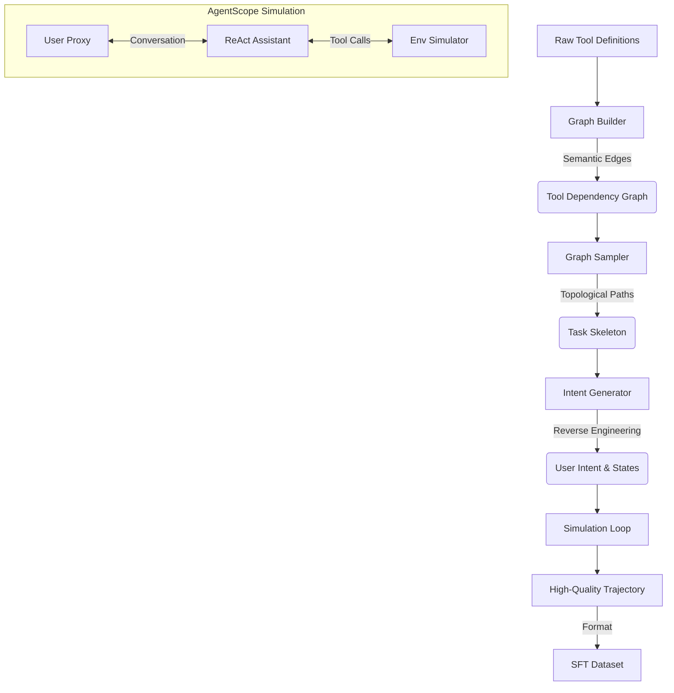

# Sloop ⛵

Sloop 是一个基于 AgentScope 框架重构的高质量、多轮对话 工具调用 (Tool-Use/Function Calling) 数据集生成框架。

它旨在解决传统合成数据中逻辑简单、缺乏真实感和多轮依赖缺失的问题，通过 "知识图谱构建 -> 骨架采样 -> 意图反推 -> 多智能体模拟" 的流水线，生产达到 Production-Ready 水平的 SFT 训练数据。

## 🌟 核心特性 (Key Features)

1. **数据为中心 (Data-Centric Architecture)**
   - **语义工具图谱 (Semantic Tool Graph)**: 利用 Embedding 和 LLM 自动构建工具之间的依赖关系图（Graph），而非随机组合。
   - **结构化采样 (Structural Sampling)**: 通过图算法采样出复杂的任务拓扑结构，包括 串行依赖 (Sequential)、并行扇出 (Fan-out) 和 多跳推理。

2. **意图反推 (Reverse Intent Generation)**
   - **先射箭再画靶**: 先确定可执行的工具链（Skeleton），再让 LLM 反向推导用户的自然语言查询（Query）和初始/终止状态（Initial/Final State）。
   - **状态驱动**: 明确定义任务的 Initial State (输入) 和 Final State (目标)，确保对话始终围绕目标进行。

3. **基于 AgentScope 的高保真模拟**
   - **ReAct Assistant**: 继承自 AgentScope 的 ReActAgent，具备真实的思维链 (Chain-of-Thought) 和自我纠错能力。
   - **User Proxy**: 基于状态自动评估任务进度的用户代理，负责发起对话、提供参数并验证结果。
   - **Environment Simulator**: 能够根据工具定义和用户意图，动态生成 Rich JSON 格式的观察结果（Observation），支持模拟 API 报错（如 404）和复杂数据结构。

4. **标准化输出**
   - **SFT Ready**: 直接生成符合 OpenAI Chat Format 的训练数据，包含完整的 user, assistant (thought + tool_calls), tool 角色序列。

## 🛠️ 系统架构 (Architecture)



## ✅ 已完成功能 (Done)

- [x] **工具图谱构建**: 支持基于 Embedding 的工具参数自动对齐和依赖发现。
- [x] **骨架采样算法**: 实现了 Sequential (线性链) 和 Neighborhood (中心辐射/扇出) 采样策略。
- [x] **意图生成器**: 支持生成包含 Initial State 和 Final State 的复杂用户意图。
- [x] **模拟器重构**:
  - 迁移至 AgentScope 框架。
  - AssistantAgent 实现标准 ReAct 范式。
  - SimulatorAgent 支持动态生成 Mock 数据。
  - UserProxyAgent 支持基于状态的自动终止判断。
- [x] **数据格式化**: 实现了 Msg 对象到 OpenAI 训练格式的无损转换。

## 🚀 路线图 (Roadmap)

### 短期计划 (v0.4+)
- [ ] **引入裁判员 (Critic/Reward Model)**: 在生成后增加一个 Evaluator Agent，自动评分并过滤掉逻辑不严密或存在幻觉的样本。
- [ ] **增强模拟器真实性**: 优化 Simulator Prompt，严格限制工具返回内容，防止"功能性幻觉"（如 List 接口返回具体详情）。
- [ ] **负样本生成 (Negative Samples)**: 构造不可解任务或参数缺失场景，训练 Agent 的 拒绝能力 (Refusal) 和 追问能力 (Clarification)。

### 长期规划 (v0.5+)
- [ ] **有状态模拟器 (Stateful Simulator)**: 引入虚拟文件系统或数据库，支持跨轮次的状态一致性检查（如先 Create ID 再 Use ID）。
- [ ] **代码解释器集成 (Code Interpreter)**: 支持生成包含 Python 代码执行的轨迹，提升 Agent 的计算和数据处理能力。
- [ ] **复杂性演化 (Evol-Instruct)**: 对现有 Intent 进行变异，注入负面约束或多目标融合，提升任务难度。

## 快速开始 (Quick Start)

1. **安装依赖**

   ```bash
   uv sync
   ```

2. **配置环境**

   ```bash
   cp .env.example .env
   ```

   然后编辑 `.env` 文件，配置模型和嵌入模型：

   ```env
   OPENAI_MODEL_BASE_URL=your_base_url
   OPENAI_MODEL_API_KEY=your_api_key
   OPENAI_MODEL_NAME=Qwen2.5-72B-Instruct  # 推荐使用强推理模型
   EMBEDDING_MODEL_NAME=your_embedding_model_name
   EMBEDDING_MODEL_API_KEY=your_embedding_api_key
   EMBEDDING_MODEL_BASE_URL=your_embedding_base_url
   ```

3. **运行流水线**

```bash
 uv run exps/graph_builder_exp.py
 uv run exps/graph_sampler_exp.py
 uv run exps/intent_generator_exp.py
 uv run exps/verify_agents.py
```

## 许可证

MIT License

Copyright (c) 2026 zhangdw156

Permission is hereby granted, free of charge, to any person obtaining a copy
of this software and associated documentation files (the "Software"), to deal
in the Software without restriction, including without limitation the rights
to use, copy, modify, merge, publish, distribute, sublicense, and/or sell
copies of the Software, and to permit persons to whom the Software is
furnished to do so, subject to the following conditions:

The above copyright notice and this permission notice shall be included in all
copies or substantial portions of the Software.

THE SOFTWARE IS PROVIDED "AS IS", WITHOUT WARRANTY OF ANY KIND, EXPRESS OR
IMPLIED, INCLUDING BUT NOT LIMITED TO THE WARRANTIES OF MERCHANTABILITY,
FITNESS FOR A PARTICULAR PURPOSE AND NONINFRINGEMENT. IN NO EVENT SHALL THE
AUTHORS OR COPYRIGHT HOLDERS BE LIABLE FOR ANY CLAIM, DAMAGES OR OTHER
LIABILITY, WHETHER IN AN ACTION OF CONTRACT, TORT OR OTHERWISE, ARISING FROM,
OUT OF OR IN CONNECTION WITH THE SOFTWARE OR THE USE OR OTHER DEALINGS IN THE
SOFTWARE.
